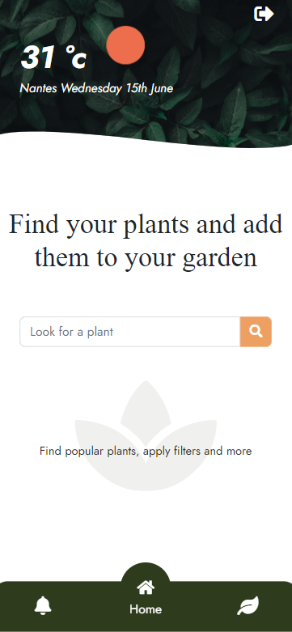
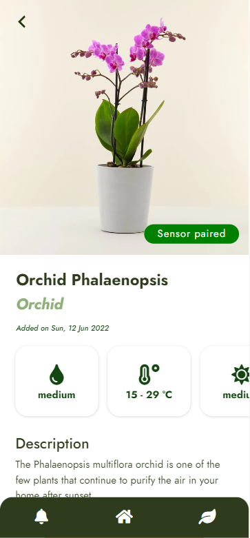
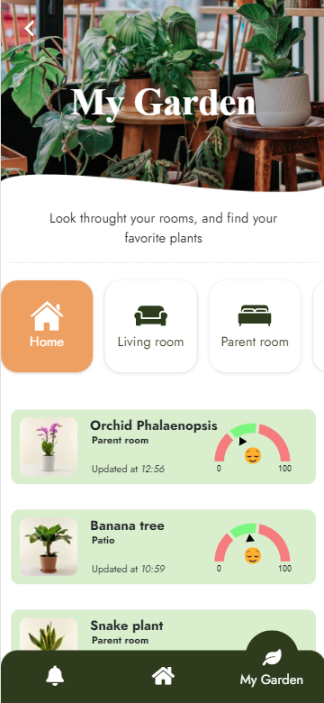
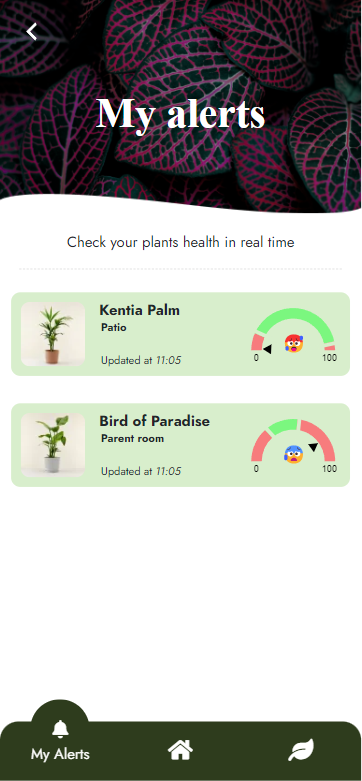

# Feed my plant 🌱
handle you plants caring anywhere in real time !
Have a look ! 👀
> Live demo [http://www.feedmyplant.com](). 

## Table of Contents
* [General Info](#general-information)
* [Technologies Used](#technologies-used)
* [Features](#features)
* [Screenshots](#screenshots)
* [Setup](#setup)
* [Usage](#usage)
* [Project Status](#project-status)
* [Room for Improvement](#room-for-improvement)
* [Acknowledgements](#acknowledgements)
* [Contact](#contact)

## General Information
feed my plant is an application that allows you to receive information on the maintenance of your plants by combining software and hardware.

the main goal of this app is to stop letting your plants die.

you can find information on the maintenance of your plants directly in the interface of the application with somes advices and you can monitor the humidity rate in the pot in real time thanks to an Arduino on-board sensor.

## Technologies Used

application :
- Ruby on Rails - version 6.1.6
- Stimulus - version 3.0.1
- Bootstrap - version 5.1.3
- Fontawsome - version 3.0
- OpenWeatherMap API - version 5.15.4

hardware : 
- arduino UNO (DHCP + GET request sending data)
- ethernet shield 
- VS-ELEC Soil humidity hygrometer detection sensor module

## Features
- Search a plant, and filter them by level of difficulty
- Get some advices / informations about each plants
- Add a plant to your collection
- Filter your plant by room
- Get Meteo information in real time

- Monitor the humidity rate in the pot in real time ! 

## Screenshots

## Setup
What are the project requirements/dependencies? Where are they listed? A requirements.txt or a Pipfile.lock file perhaps? Where is it located?

Proceed to describe how to install / setup one's local environment / get started with the project.

## Project Status
Project is: _in progress_
If you are intressed by this project fork it or you can contribute

## Room for Improvement
TODOs for future development :
- User can undock sensor 
- Scan a plant with google lens and add it into Feedmyplant
- Get PUSH notification when one of your plant need water

## Acknowledgements
Group project :
- Lucas Vittaz
- Sarah Menu
- Anthony Gouvrillon

## Contact
Created by [@lucasvittaz.pro@gmail.com]- feel free to contact me!
